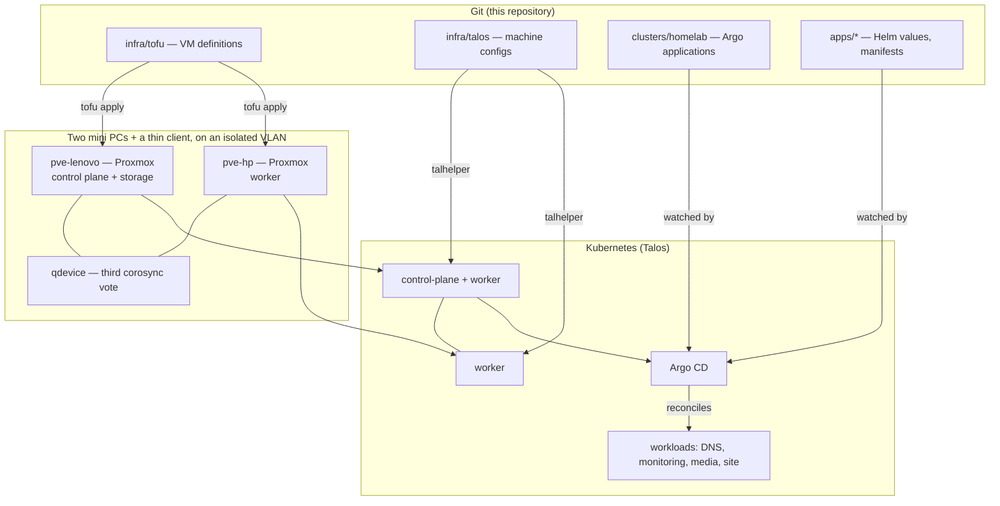

# homelab-platform

A two-node Kubernetes platform on second-hand mini PCs, defined entirely in this
repository: hypervisor VMs in OpenTofu, immutable nodes in Talos machine configs,
everything above them reconciled by Argo CD. Nothing is configured by hand, and
where something was, there is an ADR explaining why.

<!-- Badges (GitLab pipeline, Argo sync) land with the CI milestone. -->

> **Status — 2026-08-20.** The platform layer is built and verified: two Proxmox
> nodes clustered on an isolated VLAN with a three-vote corosync quorum. The
> Kubernetes layer is next; no Talos VMs exist yet. Sections below marked
> _Planned_ are designed and not yet built. This README tracks reality, not
> intent.

**Development happens on GitLab; this GitHub repository is a one-way push
mirror.** Pipelines and merge requests live upstream, which is why there is no
activity here beyond the mirrored commits — and why a pull request opened against
this copy would be overwritten by the next mirror push rather than reviewed.

---

## Why this exists

Three reasons, in order of how much they shaped the decisions:

1. **To run real infrastructure the way production is run** — declaratively,
   reviewably, and reproducibly — on hardware small enough that mistakes are
   cheap and recovery is a rebuild rather than an incident.
2. **To learn the layers rather than the abstractions.** Talos over k3s, Cilium
   over Flannel, and a manual first bootstrap are deliberate difficulty
   ([ADR-0003](docs/adr/0003-talos-linux-over-k3s.md),
   [ADR-0004](docs/adr/0004-cilium-at-bootstrap.md)).
3. **To be evidence.** The interesting artifact for a reader is not that a
   cluster runs, it is the decision trail in [`docs/adr/`](docs/adr/) — the
   rejected options, the constraints, and the failure modes found by hitting
   them.

The estate is deliberately zero-purchase and zero-subscription: inherited
hardware, free tiers, an already-owned domain, roughly 30 W of electricity.

## Architecture



## Stack

| Layer                | Choice                                                        | State   |
| -------------------- | ------------------------------------------------------------- | ------- |
| Hypervisor           | Proxmox VE 9 ([ADR-0001](docs/adr/0001-proxmox-and-clean-install.md)) | Built   |
| Cluster quorum       | Corosync qdevice on a third box (three votes)                  | Built   |
| Network segmentation | VLANs in Omada, routed by the gateway ([ADR-0002](docs/adr/0002-omada-vlans-er605-routing.md)) | Built (lab VLAN) |
| VM provisioning      | OpenTofu, `bpg/proxmox` provider                               | Planned |
| Kubernetes OS        | Talos Linux via `talhelper` ([ADR-0003](docs/adr/0003-talos-linux-over-k3s.md)) | Planned |
| CNI                  | Cilium — kube-proxy replacement, LB-IPAM, Hubble ([ADR-0004](docs/adr/0004-cilium-at-bootstrap.md)) | Planned |
| GitOps               | Argo CD, app-of-apps                                          | Planned |
| Secrets              | SealedSecrets                                                 | Planned |
| Storage              | local-path on workers; NFS from a ZFS dataset for bulk data     | Planned |
| Ingress and TLS      | Internal ingress + cert-manager with DNS-01                    | Planned |
| Public exposure      | Cloudflare Tunnel — no port forwards, no public home address    | Planned |
| Internal DNS         | Pi-hole in-cluster on a stable lab VIP                         | Planned |
| Observability        | kube-prometheus-stack, plus Hubble from bootstrap               | Planned |
| CI                   | GitLab CI, self-hosted runner in-cluster                        | Planned |

## How a change flows

```text
commit  ->  GitLab CI                    ->  Argo CD              ->  cluster
            lint, validate manifests,        detects drift from       reconciled,
            helm template / kustomize        the committed state      health reported
            diff, tofu plan
```

Nothing is applied by hand. A change to a workload is a merge request against
[`apps/`](apps/); a change to the cluster's application set is one against
[`clusters/homelab/`](clusters/homelab/); a change to the machines themselves is
one against [`infra/`](infra/) followed by a deliberate apply, because node and
VM changes are the two places where reconciliation is not automatic by design.

## Repository structure

```text
homelab-platform/
├── apps/                 # per-application Helm values and manifests
├── clusters/homelab/     # Argo CD applications (app-of-apps root)
├── infra/
│   ├── tofu/             # OpenTofu: Proxmox VMs, disks, VLAN tags
│   └── talos/            # talhelper config; rendered output is gitignored
├── docs/
│   ├── adr/              # architecture decision records
│   └── network.md        # VLAN plan, switch config, verification
└── changelog.md
```

## Scope

**This repository does:**

- define the VM layer, the Kubernetes nodes, and every workload as code
- document the decisions and the network the platform depends on
- deploy through GitOps reconciliation rather than manual application

**This repository does not:**

- hold secrets in plaintext — secrets are sealed, and rendered node configs
  containing the cluster CA are gitignored
- manage the household network beyond the lab VLAN it needs
- claim high availability: two nodes, one control plane, single-homed power

## Runtime layout

| Node         | Hardware                        | Role                                          |
| ------------ | ------------------------------- | --------------------------------------------- |
| `pve-lenovo` | Lenovo M920q, i5-9500T, 16 GB   | Proxmox; Talos control-plane + worker; storage |
| `pve-hp`     | HP ProDesk 400 G4, i3-8300T, 16 GB | Proxmox; Talos worker                       |
| qdevice      | HP t620 thin client, 4 GB       | Third corosync vote only                       |

All three sit on the lab VLAN with static addresses. Remote access is over a
mesh VPN with key-only SSH; no service is published to the internet except
through Cloudflare Tunnel. See [`docs/network.md`](docs/network.md).

## Validation

The platform layer is verified rather than assumed. Current checks:

```bash
pvecm status                                    # 3 expected votes, Quorate
grep -E 'ring0_addr' /etc/pve/corosync.conf     # ring pinned to the lab VLAN
sshd -T | grep -iE 'permitrootlogin|passwordauthentication'
smartctl -H /dev/nvme0n1                        # disk health
```

`sshd -T` reporting `permitrootlogin without-password` is the older label for
`prohibit-password` — the correct value on a Proxmox node, which needs
node-to-node root SSH for migration and cluster operations. Reading
`permitrootlogin no` on a Proxmox node would be a defect, not extra hardening;
on the qdevice, which needs no inbound root SSH, plain `no` is correct.

## Conventions

- **Commits follow [Conventional Commits](https://www.conventionalcommits.org/):**
  `feat:`, `fix:`, `docs:`, `refactor:`, `chore:`, with an optional scope —
  `feat(cilium): …`. This keeps changelog generation available later.
- **Decisions get an ADR.** A decision is not made until the ADR exists. See
  [`docs/adr/README.md`](docs/adr/README.md).
- **Notable changes go in [`changelog.md`](changelog.md)** in Keep a Changelog
  format.

## Versioning

Semantic Versioning. Breaking changes increment MAJOR, backward-compatible
additions MINOR, fixes PATCH. See [`changelog.md`](changelog.md) for history.

## Limitations

Honest ones, not placeholders:

- **No high availability.** Two nodes and a single control plane. The third
  corosync vote protects against split-brain, not against the control-plane node
  failing.
- **No replicated storage.** Longhorn or Rook-Ceph both want three nodes;
  workload data lives on local-path and NFS, backed up rather than replicated.
- **One node is storage-tight.** The worker's NVMe leaves roughly 85 GB of usable
  thin pool — adequate for one Talos worker and little else.
- **Single-homed power, no UPS.** An outage takes the whole estate down, and one
  host's firmware requires manual intervention to come back up after loss of AC.
- **Segmentation is partly organisational.** The lab VLAN exists; the inter-VLAN
  ACLs that enforce it are not built yet ([ADR-0002](docs/adr/0002-omada-vlans-er605-routing.md)).

## License

MIT — see [`LICENSE`](LICENSE). Configuration in this repository is specific to
this estate; the parts worth reusing are the ADRs and the runbook structure.
