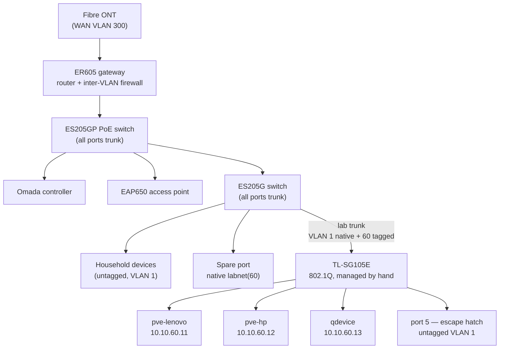

# Network

This document records the lab network design and the switch configuration it
depends on. [ADR-0002](adr/0002-omada-vlans-er605-routing.md) records the
reasoning behind the design. This document records the current state, and the
tables you need when something breaks.

No controller manages the TL-SG105E. **Its VLAN table below is therefore the only
record of its configuration.** Treat that section as configuration, not prose.

## VLAN plan

| VLAN | Name      | Subnet           | Members                                                | State           |
| ---- | --------- | ---------------- | ------------------------------------------------------ | --------------- |
| 1    | `Default` | `192.168.0.0/24` | Everything not yet migrated; the escape-hatch path      | Live (flat LAN) |
| 60   | `labnet`  | `10.10.60.0/24`  | Proxmox nodes, corosync qdevice, Talos VMs, service VIPs | **Live**        |
| 99   | `mgmt`    | `10.10.99.0/24`  | Gateway, switches, controller, access point             | Planned         |
| 30   | `trusted` | `10.10.30.0/24`  | Workstations, laptop, phone, TV streamer (trusted SSID)  | Planned         |
| 50   | `guest`   | `10.10.50.0/24`  | Guest SSID, client isolation, internet-only              | Planned         |

The Omada ER605 gateway routes between the VLANs and filters the traffic between
them. The lab has no firewall VM. See
[ADR-0002](adr/0002-omada-vlans-er605-routing.md) for the reason the project
rejected that option.

**Only VLAN 60 is built.** Every other device still sits on the flat `Default`
network. Default inter-VLAN routing keeps labnet reachable from that network.
That is deliberate for now, because a laptop on the house LAN manages the lab.
The segmentation is therefore organisational, not enforced. The planned phase
adds the ACLs that enforce it: trusted → labnet on service ports only, labnet →
trusted denied, guest isolated, mgmt reachable from trusted only.

## Physical topology



An Omada port defaults to a profile with the default LAN untagged and every VLAN
tagged. An inter-switch link therefore picks up a new VLAN with no configuration.
Only the switch that feeds the SG105E needed an explicit trunk. The controller's
Add-LAN wizard added VLAN 60, and tagged it on all ports of both Omada switches
automatically.

## TL-SG105E configuration (authoritative)

Management address: `192.168.0.5/24` on the flat LAN. The switch runs with the
DHCP client off and a changed default password. It is an "Easy Smart" switch, and
Omada cannot adopt it. It therefore never appears in the controller topology. It
appears as a client only, and only when it holds a lease.

**802.1Q VLAN table**

| VLAN | Name      | Tagged ports | Untagged ports |
| ---- | --------- | ------------ | -------------- |
| 1    | `Default` | —            | 1, 5           |
| 60   | `labnet`  | 1            | 2, 3, 4        |

**PVIDs**

| Port | PVID | Purpose                                            |
| ---- | ---- | -------------------------------------------------- |
| 1    | 1    | Trunk up to the ES205G — VLAN 1 native, 60 tagged   |
| 2    | 60   | `pve-lenovo` — `10.10.60.11`                       |
| 3    | 60   | `pve-hp` — `10.10.60.12`                           |
| 4    | 60   | qdevice — `10.10.60.13`                            |
| 5    | 1    | **Escape hatch** — untagged VLAN 1, reaches the LAN |

The build verified each port. Ports 2, 3 and 4 each handed out a `10.10.60.x`
lease, and ping and DNS worked on all three. Port 5 handed out a flat-LAN lease.
The configuration survives a power cycle without an explicit save.

## Addressing on labnet

| Range               | Use                                                              |
| ------------------- | ---------------------------------------------------------------- |
| `10.10.60.1`        | Gateway (ER605)                                                  |
| `10.10.60.11–.13`   | Static: `pve-lenovo`, `pve-hp`, qdevice                          |
| `10.10.60.50–.59`   | **Reserved for Kubernetes service VIPs** (Cilium LB-IPAM)        |
| `10.10.60.100–.199` | DHCP pool                                                        |

Upstream DNS on labnet is `1.1.1.1` and `9.9.9.9`. The gateway carries both
addresses as manual entries.

> **Keep the DHCP pool clear of the VIP range.** Cilium answers ARP for the
> addresses in `.50–.59` through L2 announcements. If the gateway can also lease
> those addresses, the collision surfaces as intermittent DNS failures rather
> than as an obvious address conflict. Confirm the exclusion before the first
> load-balanced service.

## Verification

Run these on a host on labnet:

```bash
ip -brief addr                          # expect 10.10.60.x/24
ping -c4 1.1.1.1                        # gateway routes out
getent hosts proxmox.com                # DNS resolves
```

Run these on the cluster hosts after a reboot, a cable change or a power outage:

```bash
pvecm status                            # expected votes 3, Quorate
grep -E 'ring0_addr' /etc/pve/corosync.conf   # must be 10.10.60.x
cat /sys/class/net/<iface>/speed        # expect 1000; a reseated cable
                                        # often returns at 100 silently
```

To prove that a switch port carries the right VLAN, connect a laptop to it. Then
check which subnet the lease comes from. That is the whole test, and it gated
every port above.

## Failure modes to know in advance

- **A disabled 802.1Q on the SG105E resets every PVID to 1.** Its own UI warns
  about this. All three lab hosts would land on the flat LAN while each still
  holds a `10.10.60.x` static address — all unreachable at once, with nothing in
  any host log to explain it. Check that page before you suspect the hosts.
- **The SG105E's factory address is the gateway's LAN address.** A factory reset
  on the live LAN produces an ARP conflict with the gateway. Unplug the switch
  uplink before you power the switch on after a reset. Then configure the switch
  direct-attached.
- **The port budget is full.** The ES205G has no free port, and the SG105E is
  full at three lab hosts plus uplink plus escape hatch. A fourth lab host needs
  new switch hardware — this is a real constraint on a third cluster node, not a
  detail.
- **The escape hatch is the recovery path.** If VLAN 60 breaks entirely, SG105E
  port 5 still reaches the flat LAN. That path repairs a host without a keyboard
  in the cabinet.
