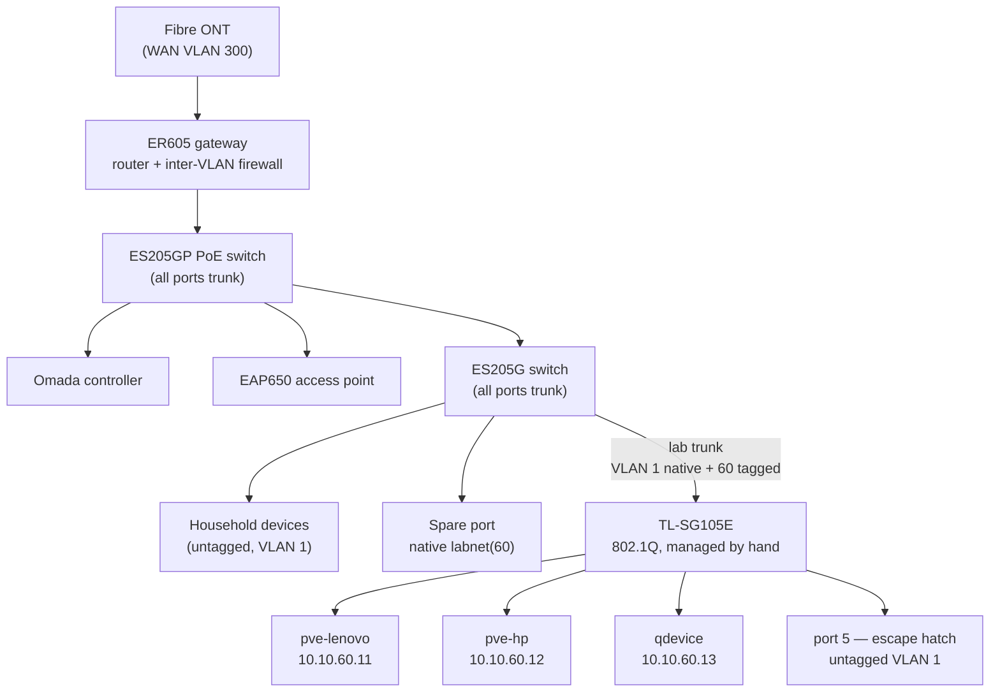

# Network

The lab's network design and the switch configuration it depends on. The
reasoning behind the design is [ADR-0002](adr/0002-omada-vlans-er605-routing.md);
this document is the current state and the tables you need when something breaks.

The TL-SG105E is not centrally managed, so **its VLAN table below is the only
record of its configuration.** Treat that section as configuration, not prose.

## VLAN plan

| VLAN | Name      | Subnet           | Members                                                | State           |
| ---- | --------- | ---------------- | ------------------------------------------------------ | --------------- |
| 1    | `Default` | `192.168.0.0/24` | Everything not yet migrated; the escape-hatch path      | Live (flat LAN) |
| 60   | `labnet`  | `10.10.60.0/24`  | Proxmox nodes, corosync qdevice, Talos VMs, service VIPs | **Live**        |
| 99   | `mgmt`    | `10.10.99.0/24`  | Gateway, switches, controller, access point             | Planned         |
| 30   | `trusted` | `10.10.30.0/24`  | Workstations, laptop, phone, TV streamer (trusted SSID)  | Planned         |
| 50   | `guest`   | `10.10.50.0/24`  | Guest SSID, client isolation, internet-only              | Planned         |

Routing and inter-VLAN firewalling are done by the Omada ER605 gateway. There is
no firewall VM — see [ADR-0002](adr/0002-omada-vlans-er605-routing.md) for why
that option was rejected.

**Only VLAN 60 is built.** Everything else still sits on the flat `Default`
network, and labnet is currently reachable from it by default inter-VLAN routing.
That is deliberate for now — it is how the lab is managed from a laptop on the
house LAN — but it means the segmentation is organisational, not enforced. The
ACLs that make it real are the planned phase: trusted → labnet on service ports
only, labnet → trusted denied, guest isolated, mgmt reachable from trusted only.

## Physical topology



Omada ports default to a profile carrying the default LAN untagged plus every
VLAN tagged, so inter-switch links pick up new VLANs with no configuration. Only
the switch feeding the SG105E needed an explicit trunk. Adding VLAN 60 was
handled by the controller's Add-LAN wizard, which tagged it on all ports of both
Omada switches automatically.

## TL-SG105E configuration (authoritative)

Management: `192.168.0.5/24` on the flat LAN, DHCP client disabled, default
password changed. It is an "Easy Smart" switch, **not** Omada-adoptable, so it
never appears in the controller topology — only as a client, and only if it holds
a lease.

**802.1Q VLAN table**

| VLAN | Name      | Tagged ports | Untagged ports |
| ---- | --------- | ------------ | -------------- |
| 1    | `Default` | —            | 1, 5           |
| 60   | `labnet`  | 1            | 2, 3, 4        |

**PVIDs**

| Port | PVID | Purpose                                            |
| ---- | ---- | -------------------------------------------------- |
| 1    | 1    | Trunk up to the ES205G — VLAN 1 native, 60 tagged   |
| 2    | 60   | `pve-lenovo` — `10.10.60.11`                       |
| 3    | 60   | `pve-hp` — `10.10.60.12`                           |
| 4    | 60   | qdevice — `10.10.60.13`                            |
| 5    | 1    | **Escape hatch** — untagged VLAN 1, reaches the LAN |

Verified port by port: 2, 3 and 4 each handed out a `10.10.60.x` lease with
working ping and DNS, and port 5 handed out a flat-LAN lease. The configuration
survives a power cycle without an explicit save.

## Addressing on labnet

| Range               | Use                                                              |
| ------------------- | ---------------------------------------------------------------- |
| `10.10.60.1`        | Gateway (ER605)                                                  |
| `10.10.60.11–.13`   | Static: `pve-lenovo`, `pve-hp`, qdevice                          |
| `10.10.60.50–.59`   | **Reserved for Kubernetes service VIPs** (Cilium LB-IPAM)        |
| `10.10.60.100–.199` | DHCP pool                                                        |

Upstream DNS on labnet is `1.1.1.1` and `9.9.9.9`, set manually on the gateway.

> **The DHCP pool must never overlap the VIP range.** Cilium answers ARP for
> addresses in `.50–.59` via L2 announcements; if the gateway can also lease them,
> the collision surfaces as intermittent DNS failures rather than as an obvious
> address conflict. Confirm the exclusion before the first load-balanced service.

## Verification

From a host on labnet:

```bash
ip -brief addr                          # expect 10.10.60.x/24
ping -c4 1.1.1.1                        # gateway routes out
getent hosts proxmox.com                # DNS resolves
```

From the cluster hosts, after any reboot, recabling or power outage:

```bash
pvecm status                            # expected votes 3, Quorate
grep -E 'ring0_addr' /etc/pve/corosync.conf   # must be 10.10.60.x
cat /sys/class/net/<iface>/speed        # expect 1000; a reseated cable
                                        # often returns at 100 silently
```

To prove a switch port carries the right VLAN, put a laptop on it and check
which subnet the lease comes from. That is the whole test, and it is the one that
was used to gate every port above.

## Failure modes worth knowing in advance

- **802.1Q disabled on the SG105E resets every PVID to 1.** Its own UI warns
  about this. All three lab hosts would land on the flat LAN while still holding
  `10.10.60.x` statics — all unreachable at once, with nothing in any host log to
  explain it. Check that page before suspecting the hosts.
- **The SG105E's factory address is the gateway's LAN address.** A factory reset
  while it is cabled to the live LAN produces an ARP conflict with the gateway.
  Unplug its uplink before powering it on after a reset, and configure it
  direct-attached.
- **Port budget is full.** The ES205G has no free port, and the SG105E is full at
  three lab hosts plus uplink plus escape hatch. A fourth lab host needs new
  switch hardware — this is a real constraint on adding a third cluster node, not
  a detail.
- **The escape hatch is the recovery path.** If VLAN 60 breaks entirely, SG105E
  port 5 still reaches the flat LAN, which is how a host gets fixed without a
  keyboard in the cabinet.
